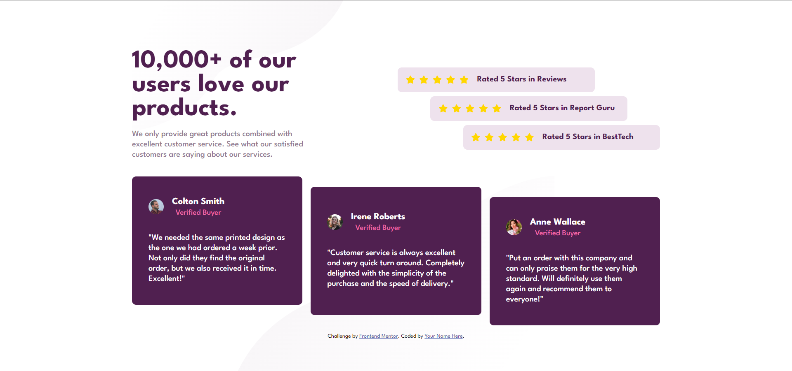
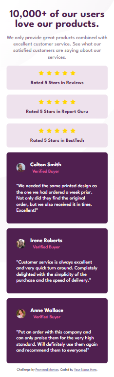

# Frontend Mentor - Clipboard landing page solution

This is a solution to the [Social proof sectionr](https://www.frontendmentor.io/challenges/social-proof-section-6e0qTv_bA/hub/social-proof-section-H14fvK3S9). Frontend Mentor challenges help you improve your coding skills by building realistic projects. 

## Table of contents

- [Overview](#overview)
  - [The challenge](#the-challenge)
  - [Screenshot](#screenshot)
  - [Links](#links)
- [My process](#my-process)
  - [Built with](#built-with)
  - [What I learned](#what-i-learned)
  - [Continued development](#continued-development)
  - [Useful resources](#useful-resources)
- [Author](#author)
- [Acknowledgments](#acknowledgments)

## Table of contents

- [Overview](#overview)
  - [The challenge](#the-challenge)
  - [Screenshot](#screenshot)
  - [Links](#links)
- [My process](#my-process)
  - [Built with](#built-with)
- [Author](#author)
- [Acknowledgments](#acknowledgments)

## Overview

### The challenge

Users should be able to:

- View the optimal layout for the site depending on their device's screen size

### Screenshot
- Desktop

- Mobile

### Links

- Solution URL: [Github](https://github.com/aimdexter/social_proof)

- Live Site URL: [Demo](https://aimdexter.github.io/social_proof/)

## My process

### Built with

- Semantic HTML5 markup
- Scss
- CSS custom properties
- Flexbox
- CSS Grid
- Mobile-first workflow

## Author

- Website - [Aimdexter](https://github.com/aimdexter)
- Frontend Mentor - [@aimdexter](https://www.frontendmentor.io/profile/aimdexter)

## Acknowledgments
Challenge by <a href="https://www.frontendmentor.io?ref=challenge" target="_blank">Frontend Mentor</a>.
Coded by <a href="https://github.com/aimdexter">Aimdexter</a>.

